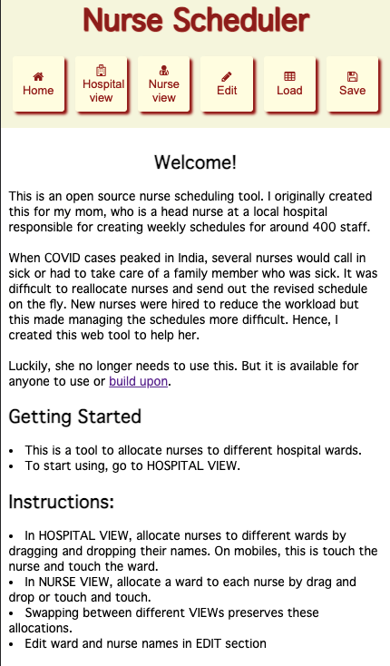
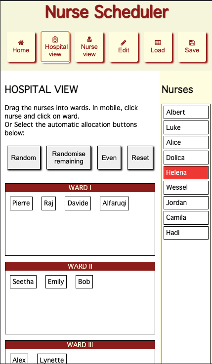
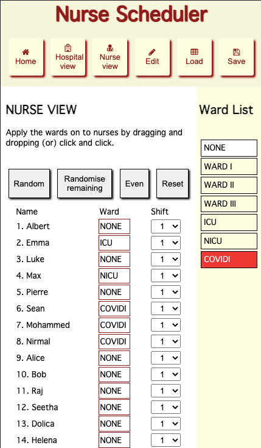
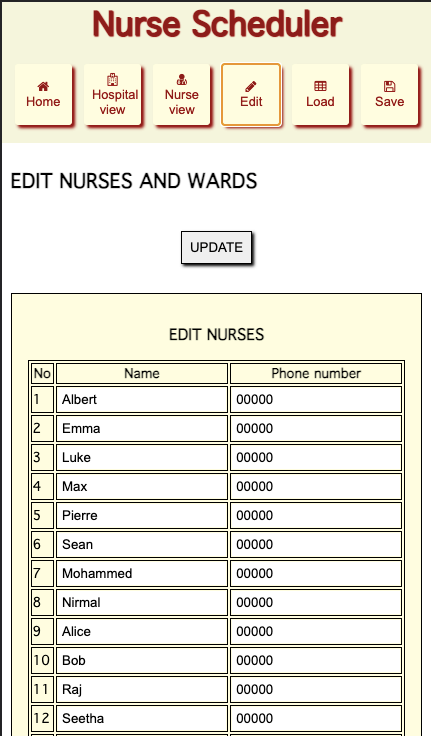
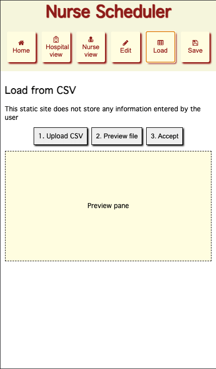
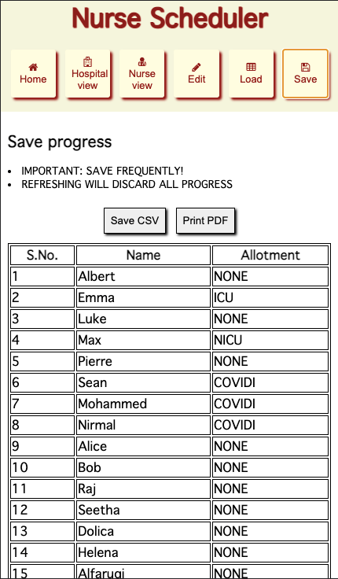

# Nurse Scheduler
This is a web interface for manual nurse scheduling. This does not solve the nurse-scheduling problem in computer science. It was created to simplify tasks for my mother who is a head nurse at a hospital. 

Use the tool at [VivekTRamamoorthy.github.io/NurseScheduler](https://VivekTRamamoorthy.github.io/NurseScheduler)

  
  
  
  

## Getting Started 
- This is a tool to allocate nurses to different hospital wards.  
- To start using, go to HOSPITAL VIEW. 
## Instructions: 
- In HOSPITAL VIEW, allocate nurses to different wards by dragging and dropping their names. On mobiles, this is touch the nurse and touch the ward.
- In NURSE VIEW, allocate a ward to each nurse by drag and drop or touch and touch.
- Swapping between different VIEWs preserves these allocations.
- Edit ward and nurse names in EDIT section.
## Saving progress:
- Save progress in a CSV file using SAVE menu.  
- Load your progress from the same CSV file using LOAD menu. 
- You can load data from a large database using a CSV in the same format. 
 ## Important
- DO NOT REFRESH the site without exporting your progress or all progress will be discarded.
- SAVE your progress frequently as a CSV file and reload them later. 
## Data security: 
- This static site does not process your data in a server. 
- Your data stays within your device.  

## License

MIT license 2021